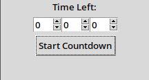

# Python Timer

This is a minimal countdown timer application built with Python's `tkinter` library for the GUI.

## Features

- Simple and clean GUI
- Uses `Spinbox` widgets to select hours, minutes, and seconds
- Displays a live-updating countdown
- Disables the start button during countdown to prevent overlapping timers
- Alerts when the countdown reaches zero

## How It Works

- You choose the time using the Spinboxes (HH:MM:SS)
- Press the **Start Countdown** button
- The remaining time is shown and updated every second

## Requirements

- Python 3.6 or higher (tested with Python 3.12)
- No external libraries required — uses only the built-in `tkinter`

## Running the App

```bash
python Python-Timer.py
```

## Screenshot


